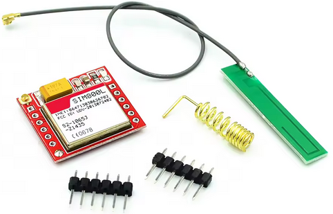
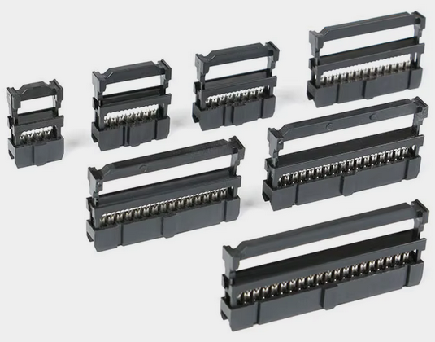
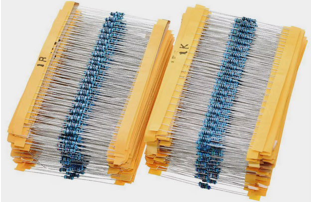
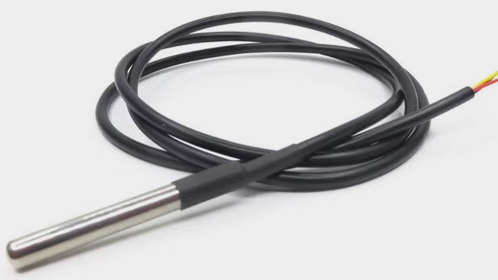

<div align="center">

# Заготовка-M

</div>

SPDX-License-Identifier: GPL-2.0-only or commercial

## Внимание:
Данное программное обеспечение является экспериментальным и находится в стадии разработки. Ни при каких обстоятельствах эти файлы не должны использоваться в отношении любой критически важной системы (систем). Использование этих файлов осуществляется на ваш страх и риск. ПРОГРАММНОЕ ОБЕСПЕЧЕНИЕ ПРЕДОСТАВЛЯЕТСЯ «КАК ЕСТЬ», БЕЗ КАКИХ-ЛИБО ГАРАНТИЙ, ЯВНЫХ ИЛИ ПОДРАЗУМЕВАЕМЫХ, ВКЛЮЧАЯ, НО НЕ ОГРАНИЧИВАЯСЬ, ГАРАНТИЯМИ ТОВАРНОГО СОСТОЯНИЯ, ПРИГОДНОСТИ ДЛЯ КОНКРЕТНОЙ ЦЕЛИ И НЕНАРУШЕНИЯ ПРАВ. НИ ПРИ КАКИХ ОБСТОЯТЕЛЬСТВАХ АВТОРЫ ИЛИ ПРАВООБЛАДАТЕЛИ НЕ НЕСУТ ОТВЕТСТВЕННОСТИ ЗА ЛЮБЫЕ ПРЕТЕНЗИИ, УБЫТКИ ИЛИ ДРУГИЕ ОБЯЗАТЕЛЬСТВА, БУДЬ ТО ДОГОВОРНЫЕ, ГРАЖДАНСКО-ПРАВОВЫЕ ИЛИ ИНЫЕ, ВОЗНИКАЮЩИЕ ИЗ, ИЗ ИЛИ В СВЯЗИ С ПРОГРАММНЫМ ОБЕСПЕЧЕНИЕМ, ИСПОЛЬЗОВАНИЕМ ИЛИ ИНЫМИ ДЕЙСТВИЯМИ С ПРОГРАММНЫМ ОБЕСПЕЧЕНИЕМ

## Notice:
This software is experimental and a work in progress. Under no circumstances should these files be used in relation to any critical system(s). Use of these files is at your own risk. THE SOFTWARE IS PROVIDED "AS IS", WITHOUT WARRANTY OF ANY KIND, EXPRESS OR IMPLIED, INCLUDING BUT NOT LIMITED TO THE WARRANTIES OF MERCHANTABILITY, FITNESS FOR A PARTICULAR PURPOSE AND NONINFRINGEMENT. IN NO EVENT SHALL THE AUTHORS OR COPYRIGHT HOLDERS BE LIABLE FOR ANY CLAIM, DAMAGES OR OTHER LIABILITY, WHETHER IN AN ACTION OF CONTRACT, TORT OR OTHERWISE, ARISING FROM, OUT OF OR IN CONNECTION WITH THE SOFTWARE OR THE USE OR OTHER DEALINGS IN THE SOFTWARE.

## Информация для разработчиков фронтенда
Все необходимое находится в папке "web_root". [перейти в web_root](https://github.com/zagotovka/Zagotovka_M/tree/main/web_root)
Для установки и запуска веб-интерфейса с Vite (Debian):
```bash
sudo apt update
sudo apt install nodejs npm
npm init -y
rm -rf node_modules
npm install
npm install preact-router
npm install history
npm run start
```

## Информация для разработчиков бэкенда
- STM32CubeIDE Version: 1.15.1
- FREERTOS Version: V10.2.1 CMSIS_V2
- Mongoose Version: 7.13

### Информация для электриков: <a href="https://youtu.be/dl3f8Jo28ps"></a>&nbsp;&nbsp;<a href="https://rutube.ru/video/a7eb1218174d5f78254775de943bdcde/"></a>
Для данного проекта схема, которая использует распределительные коробки, не подходит!

<p float="left">
  <a href="/icons/provoda_OLD.png" target="_blank">
    
  </a>
  <a href="/icons/OLD_sxema.png" target="_blank">
    
  </a>
</p>

### Необходимо реализовать прямую проводку:
От каждой точки (розетки, выключателя, потолочной лампы и т.п.) до электрощитка!

<p float="left">
<a href="/icons/provoda_NEW.png" target="_blank">
  
</a>
<a href="/icons/New_sxema.png" target="_blank">
    
  </a>
</p>

## Что купить:
1. [](https://aliexpress.ru/wholesale?SearchText=NUCLEO-F767ZI&g=y&page=1) NUCLEO-F767ZI
2. [](https://aliexpress.ru/wholesale?SearchText=GSM+Module+SIM800L&g=y&page=1) GSM Module SIM800L
3. [](https://aliexpress.ru/wholesale?SearchText=Jumper+cap+2.54&g=y&page=1) Jumper cap 2.54
4. [](https://aliexpress.ru/wholesale?SearchText=10pcs+2.54MM+pitch+MALE+SOCKET+straight+idc+box+headers+&g=y&page=1) 20P и 5P 2,54мм
5. [](https://aliexpress.ru/wholesale?SearchText=10+%D1%88%D1%82.+2%252C54+%D0%BC%D0%BC+80+Pin+%D1%88%D0%B0%D0%B3+%D1%88%D1%82%D1%8B%D1%80%D0%B5%D0%B2%D0%BE%D0%B9+%D0%B4%D0%B2%D1%83%D1%85%D1%80%D1%8F%D0%B4%D0%BD%D1%8B%D0%B9&g=y&page=1) 2 шт. 2,54 мм 80 Pin штыревой двухрядный
6. [](https://aliexpress.ru/wholesale?SearchText=%D0%9A%D0%BB%D0%B5%D0%BC%D0%BC%D0%BD%D0%B0%D1%8F+%D0%BA%D0%BE%D0%BB%D0%BE%D0%B4%D0%BA%D0%B0+KF301-+2+P&g=y&page=1) Клеммная колодка KF301- 2P
7. [](https://aliexpress.ru/item/1005008062387765.html) Двухрядный разъем FC-6P и FC-20P 2,54 мм
8. [](https://aliexpress.ru/wholesale?SearchText=%D0%9F%D0%BB%D0%BE%D1%81%D0%BA%D0%B8%D0%B9+%D0%BB%D0%B5%D0%BD%D1%82%D0%BE%D1%87%D0%BD%D1%8B%D0%B9+%D0%BA%D0%B0%D0%B1%D0%B5%D0%BB%D1%8C+%D0%B4%D0%BB%D1%8F+IDC+2%252C0+%D0%BC%D0%BC+FC+&g=y&page=1) Плоский ленточный кабель для разъема IDC FC 2,54 мм 40P и 12P
9. [](https://aliexpress.ru/wholesale?SearchText=resistor&g=y&page=1) Резисторы 2.2K 90шт. и 10К 90шт.
10. [](https://aliexpress.ru/wholesale?SearchText=%D0%9A%D0%B0%D0%B1%D0%B5%D0%BB%D1%8C-%D0%BF%D0%B5%D1%80%D0%B5%D1%85%D0%BE%D0%B4%D0%BD%D0%B8%D0%BA+%D1%81+Micro+USB+%D0%BD%D0%B0+OTG&g=y&page=1) Кабель-переходник с Micro USB 5Pin папа на USB
11. [](https://aliexpress.ru/wholesale?SearchText=DC-DC+Buck+Converter+4.5V-16V+9V+12V+to+5V+3.3V+Step-down+Power+Voltage+Regulator+Module+Efficiency+98%25&g=y&page=1) DC DC преобразователь
12. [](https://aliexpress.ru/wholesale?SearchText=%D0%A2%D0%B2%D0%B5%D1%80%D0%B4%D0%BE%D1%82%D0%B5%D0%BB%D1%8C%D0%BD%D1%8B%D0%B9+%D1%80%D0%B5%D0%BB%D0%B5%D0%B9%D0%BD%D1%8B%D0%B9+%D0%BC%D0%BE%D0%B4%D1%83%D0%BB%D1%8C&g=y&page=1) Твердотельный релейный модуль
13. [](https://aliexpress.ru/wholesale?SearchText=2.54mm+Double+Row+Straight+Female+2-40P&g=y&page=1) Двухрядный прямой гнездовой разъем
### Gerber файлы: <a href="https://youtu.be/3tv2-pYXrjg"></a>&nbsp;&nbsp;<a href="https://rutube.ru/video/private/9b2cea71a3b7a72765657751a905738c/?p=SsnMQCw9kL5LmihFU1ot_Q"></a>
a. <a href="https://easyeda.com/editor#id=|e6a461cf7da546748c711f5ae1138cd7|2ffd4d2211de4b4ba91e1188545134c2" target="_blank">Zagotovka</a>  
b. <a href="https://easyeda.com/editor#id=|23ee55cfd3e24ca19753cbba7066c13f|d1e252ee42ab4fbfb84c61a65fa2982f" target="_blank">Zagotovka-CN11</a>  
c. <a href="https://easyeda.com/editor#id=|7e31c289e9f742a2acfa7db54bbde58a|30d6a426a32f425b8c8ff5ba5bdb792b" target="_blank">Zagotovka-CN12</a>  
d. <a href="https://easyeda.com/editor#id=|125ff34d97324d308c97b01793449de7|1bc69b35cc6d419080bf3461774739e3" target="_blank">Zagotovka-10</a>
## Где заказать печатные платы:
- [Обсуждение на форуме](https://community.alexgyver.ru/threads/resheno-u-kogo-zakazyvat-pechatnye-platy-vo-vremja-dejstvija-sankcij.6818/page-9)

## Необязательные покупки:
15. [](https://aliexpress.ru/wholesale?SearchText=%D0%AD%D0%BD%D0%BA%D0%BE%D0%B4%D0%B5%D1%80&g=y&page=1) Энкодер
16. [](https://aliexpress.ru/wholesale?SearchText=%D0%9F%D1%80%D0%BE%D0%B2%D0%BE%D0%B4%D0%BD%D0%BE%D0%B9+%D0%BC%D0%B0%D0%B3%D0%BD%D0%B8%D1%82%D0%BD%D1%8B%D0%B9+%D0%B4%D0%B2%D0%B5%D1%80%D0%BD%D0%BE%D0%B9%2C+%D0%BE%D0%BA%D0%BE%D0%BD%D0%BD%D1%8B%D0%B9+%D0%BA%D0%BE%D0%BD%D1%82%D0%B0%D0%BA%D1%82%D0%BD%D1%8B%D0%B9+%D0%B3%D0%B5%D1%80%D0%BA%D0%BE%D0%BD&g=y&page=1) Геркон
17. [](https://aliexpress.ru/wholesale?SearchText=ds18b20&g=y&page=1) DS18B20
18. [](https://aliexpress.ru/wholesale?SearchText=dht22&g=y&page=1) DHT22
19. [](https://aliexpress.ru/wholesale?SearchText=TTP223&g=y&page=1) TTP223
20. [](https://aliexpress.ru/wholesale?SearchText=%D0%9A%D0%B0%D0%B1%D0%B5%D0%BB%D1%8C+Dupont+Line+%D0%B4%D0%BB%D1%8F+Arduino&g=y&page=1) Arduino провода

## [Скачать прошивку и как прошить stm32?](https://github.com/zagotovka/Zagotovka_M/raw/main/Proshivka/Zagotovka_M.bin)

## Видеогид по интерфейсу.

### Как пользоваться страницей "Кнопки" <a href="https://youtu.be/pMmqkwCnVaM"></a>&nbsp;&nbsp;<a href="https://rutube.ru/video/b3336efe85e3811c379922c55f8c6e0f/"></a>
### Как пользоваться страницей "Выключатели" <a href=" https://youtu.be/C74IQA4-2aI"></a>&nbsp;&nbsp;<a href="https://rutube.ru/video/2d1cbc007f3da4553a70387ba9ce4421/"></a>
### Как пользоваться страницей "Энкодеры" (в процессе разработки) <a href="https://youtu.be/mRENaW0x7i8"></a>&nbsp;&nbsp;<a href="https://rutube.ru/video/2289862620f6aff184af8c90487910ff/"></a>
### Как пользоваться страницей "Таймеры" <a href="https://youtu.be/8pgqBO4cKdg"></a>&nbsp;&nbsp;<a href="https://rutube.ru/video/1268e322b1618adb77710be2fff14bf2/"></a>
### Как пользоваться страницей "OneWire" <a href="https://youtu.be/FTfkruXgUT0"></a>&nbsp;&nbsp;<a href="https://rutube.ru/video/11652a191dc348f2218f202b141a8c76/"></a>
### Как пользоваться страницей "Безопасность" <a href="https://youtu.be/N9od6Ji41jU"></a>&nbsp;&nbsp;<a href="https://rutube.ru/video/0043b0287f85fee9c82f10104955ec85/"></a>

<details>

<summary>Система версионирования</summary>

<small>
Данный проект использует семантическое версионирование. Номер версии имеет формат MAJOR.MINOR.PATCH.

### Объяснение компонентов версии

#### MAJOR (первое число)
- Увеличивается при внесении несовместимых изменений
- Пример: переход с 1.x.x на 2.0.0 означает значительные изменения, которые могут нарушить существующую функциональность

#### MINOR (второе число)
- Увеличивается при добавлении новой функциональности с сохранением обратной совместимости
- Обнуляется при увеличении MAJOR версии
- Пример: переход с 1.1.x на 1.2.0 означает новые функции без нарушения работы существующих

#### PATCH (третье число)
- Увеличивается при исправлении ошибок, не затрагивающих основную функциональность
- Обнуляется при увеличении MAJOR или MINOR версии
- Пример: изменение с 1.1.1 на 1.1.2 означает исправление мелких ошибок
</small>

</details>

### История версий

| Версия | Дата       | Описание               |
|--------|------------|------------------------|
| 1.0.0  | 11-01-2025 | Первый стабильный релиз |
